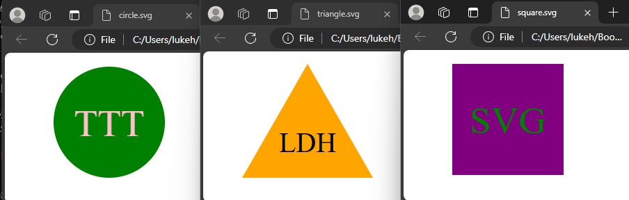

# SVG Image Generator

https://www.loom.com/share/6c7f0cd7d03a40cda173008332d76a74?sid=6bb0f758-1668-4b8a-84d5-4908c91badec

## Description

In this program I built a CLI program that can generate a simple SVG logo. I did this to gain a deeper understanding of Object Oriented Program and Jest.

- [Installation](#installation)

- [Usage](#usage)

- [Credits](#credits)

- [License](#license)

- [Features](#features)

- [Tests](#tests)

## Installation

This program is run from the command line and requires the Inquirer package.

- [Badges](#badges)

## Usage

The program takes input regarding the text, shape, text color, and shape color. The text must be 1 top 3 letters, the shape can be either a triangle, circle, or square. The color options can be added as either a color keyword or a hex code.

## Badges

## Features

Please feel free to reach out if you would like to discuss collaboration.

## Credits

Inquirer, Jest

## License

This software is licensed under the MIT license.

## Tests

Tests created with Jest. Can be run from the command line with 'npm run tests'.
